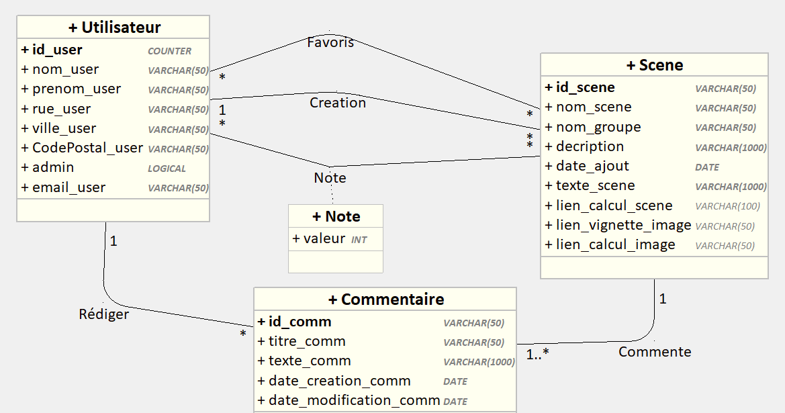

Pour démarer le projet:  

git clone https://gitlab.univ-artois.fr/sae.a.01/sae.a.01_php.git  

cd sae.a.01_php/poc-sae3-01-grp02  

composer install  
npm install  
npm run build  
cp .env.example .env  

php artisan key:generate  
php artisan migrate  
php artisan db:seed  

php artisan serve  

Diagramme de classes:  

